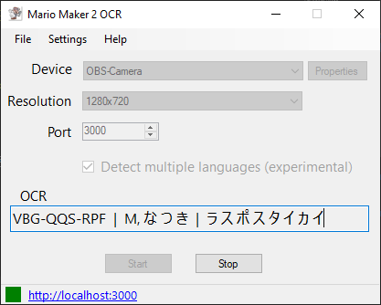
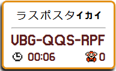

# Mario Maker 2 OCR
This program will capture level info & events from a Mario Maker 2 game feed and display on a locally hosted web app. This includes the the level name, level code, level creator, death counter and level timer. 


## Install
- Download [MarioMaker2OCR.zip](https://github.com/dram55/MarioMaker2OCR/releases) from releases.
- Extract and run `Mario Maker 2 OCR.exe`
- Use the [Video Instructions](https://youtu.be/HsQZIANz1Yc) or read the text Setup section below to use. 

## Example
Example of the program in use from [Karibukai Play](https://youtu.be/myG9h01B4Bs?t=445).

## Screenshots
 

## Stream Overlays
 





## How To Use
### Setup
- If you are using OBS, download the [OBS-VirtualCam](https://obsproject.com/forum/resources/obs-virtualcam.949/) plugin.
    - Needed because this program can't access a capture card already in use by OBS.
- In OBS, put a Filter -> Effect on your capture device, select the 'VirtualCam' effect.
- Be sure to press the 'Start' button on the VirtualCam. This needs to be done everytime you start OBS.

### Use
1) Open OBS before this program.
1) In OBS, verify the VirtualCam is started. 
1) Open the Mario Maker 2 OCR program.
1) Select the capture device with Mario Maker 2 gameplay from the dropdown 
   - Make sure the capture device name matches the "Target Camera" name from Setup
   - OBS has their own Virtual Camera now that shows up as "OBS Virtual Camera" that is not the device you want to use.
   - If the camera does not show up in the OCR, try uninstalling and reinstalling the VirtualCameras
1) Select a port number to host the web server.
1) Select the resolution.
1) Press **Start** button.
1) The bottom status strip is updated.
   - A green box indicates the program is running. 
   - Link will allow you to look at the web overlays, which display current level data.
1) Setup a Browser source in OBS to point to the web overlay you would like.
    - ex: http://localhost:3000/smmbar
    - ex: http://localhost:3000/drambar
    - ex: http://localhost:3000/mariobar
    - Refresh cache on the browser source if it is ever unresponsive.
1) Play Mario Maker 2...
1) When an event is detected:
   - The level information is written to `ocrLevel.json` file. 
   - The web overlays will updated.
   
### Customization
To customize the included overlays (font, color, etc.) make adjustments to the settings file for the overlay you are using: ex: `\web\drambar\settings.js`.

The `web` directory is where the web server will be hosted, any web apps created here can be used as a stream overlay. Feel free to create and share your own!


## Technical
The [wiki](https://github.com/dram55/MarioMaker2OCR/wiki/Program-Details) contains documentation on the program logic.


### Websocket Message API
Once the program is started, the following websocket messages will be broadcast when detected. By default the address for this is `ws://localhost:3000/wss`. This is how the web overlays are updated. If you are integrating an external bot or custom overlay, you should connect to this web socket server and read in the messages.
``` JSON
On new level
{
  "level": {
    "author": "Valdio",
    "code": "8DY-1WC-FQG",
    "name": "Thwomping Grounds"
  }
}

On level clear
{
   "type" : "clear",
   "data" : "01'54\"743"
}

On death
{ "type" : "death" }

On start over
{ "type" : "restart" }

On exit or quit
{ "type" : "exit" }

On gameover
{ "type" : "gameover" }

On skip
{ "type" : "skip" }

On world record
{ "type" : "worldrecord" }

On first clear
{ "type" : "firstclear" }

```


### Dependecies
The [OpenCV](https://opencv.org/) library is used for image processing and [Tesseract](https://opensource.google.com/projects/tesseract) library is used for OCR (Optical Character Recognition). [EmguCV](http://www.emgu.com/wiki/index.php/Main_Page) provides a .NET wrapper for both of these libraries and is directly used for this project. [EmbedIO](https://github.com/unosquare/embedio) for Websocket and HTTP server.

### NuGet Packages
https://github.com/dram55/MarioMaker2OCR/network/dependencies

### Troubleshooting
 - See list of known [issues](https://github.com/dram55/MarioMaker2OCR/issues).
 - Must have Windows Media Player installed. This is not installed by default in Windows "N" or "KN" versions. ([issue 57](https://github.com/dram55/MarioMaker2OCR/issues/57))

## Contribution
- [dram55](https://twitter.com/dram555) - Original OCR program to read level info to a file.
- zi - (zi#7981 on discord) - Added preview window, websocket/http server broadcasting for all events, warp bar style html page, and various fixes/performance improvements. 
