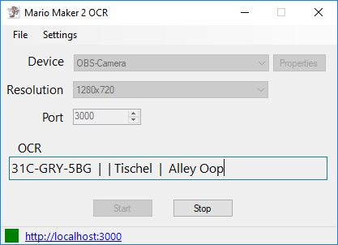
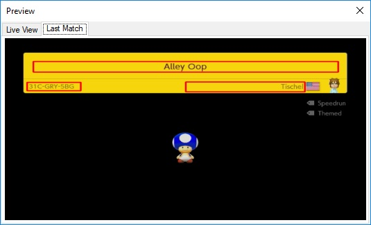
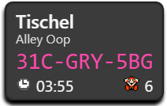
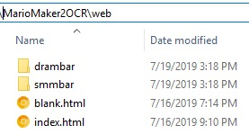

# Mario Maker 2 OCR
This program will capture level information & events from a Mario Maker 2 game feed and display on a locally hosted web app. 

### [Video Instructions - https://youtu.be/HsQZIANz1Yc](https://youtu.be/HsQZIANz1Yc)

## Install
- Download [MarioMaker2OCR.zip](https://github.com/dram55/MarioMaker2OCR/releases) from releases.
- Extract and run `Mario Maker 2 OCR.exe`


## Screenshots
 

## Stream Overlays
 




## How To Use
### Setup
- If you are using OBS, download the [OBS-VirtualCam](https://obsproject.com/forum/resources/obs-virtualcam.539/) plugin.
    - Needed because this program can't access a capture card already in use by OBS.
- In OBS, put an 'Effect' on your capture device, select the 'VirtualCam' effect.
- Be sure to press the 'Start' button on the VirtualCam.

### Use
1) Open OBS before this program to avoid conflict.
1) In OBS, verify the VirtualCam is running. 
1) Open the Mario Maker 2 OCR program.
1) Select the capture device with Mario Maker 2 gameplay from the dropdown (use OBS VirtualCam from setup).
1) Select a port number to host the web server.
1) Select the resolution.
1) Press **Start** button.
1) The bottom status strip is updated.
   - A green box indicates the program is running. 
   - Link will allow you to look at the web overlays, which display current level data.
1) Setup a Browser source in OBS to point to the web overlay you would like.
    - ex: http://localhost:3000/smmbar
    - ex: http://localhost:3000/drambar
    - Select option to have the source refresh every time it is displayed.
1) Play Mario Maker 2...
1) When an event is detected:
   - The level information is written to `ocrLevel.json` file. 
   - The web overlays will updated.

## Technical
The [wiki](https://github.com/dram55/MarioMaker2OCR/wiki/Program-Details) contains documentation on the program logic.

### Create your own overlays
In the `\web` directory you will see overlays to use/modify as an example. Check the `settings.js` in each project for customization. 

This directory is where the web server will be hosted, any web apps created here can be used as a stream overlay. The apps can read in the broadcasted websocket messages listed below and display the information as desired.



### Websocket Message API
``` JSON
-- Outgoing Message API --
On new level
{
  "level": {
    "author": "Valdio",
    "code": "8DY-1WC-FQG",
    "name": "Thwomping Grounds"
  }
}

On death
{ "type" : "death" }

On start over
{ "type" : "restart" }

On exit
{ "type" : "exit" }

On level clear
{ "type" : "clear" }

On gameover
{ "type" : "gameover" }

```


### Dependecies
The [OpenCV](https://opencv.org/) library is used for image processing and [Tesseract](https://opensource.google.com/projects/tesseract) library is used for OCR (Optical Character Recognition). [EmguCV](http://www.emgu.com/wiki/index.php/Main_Page) provides a .NET wrapper for both of these libraries and is directly used for this project. [EmbedIO](https://github.com/unosquare/embedio) for Websocket and HTTP server.

### NuGet Packages
https://github.com/dram55/MarioMaker2OCR/network/dependencies

## Contribution
- [dram55](https://twitter.com/dram555) - Original OCR program to read level info to a file.
- zi - (zi#7981 on discord) - Added preview window, websocket/http server broadcasting for all events, warp bar style html page, and various fixes/performance improvements. 